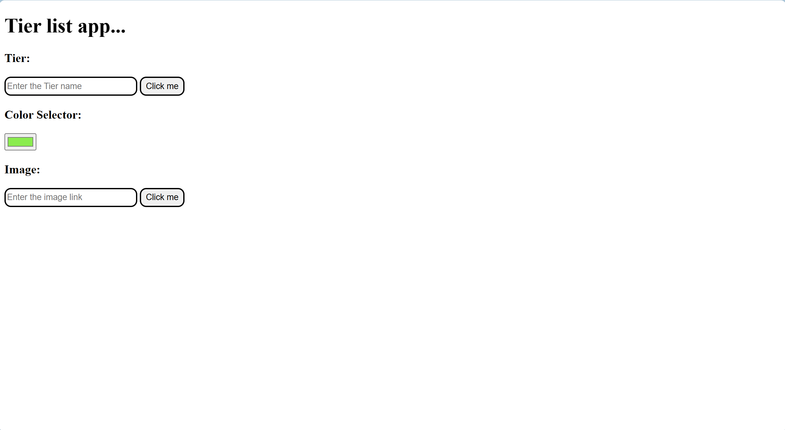
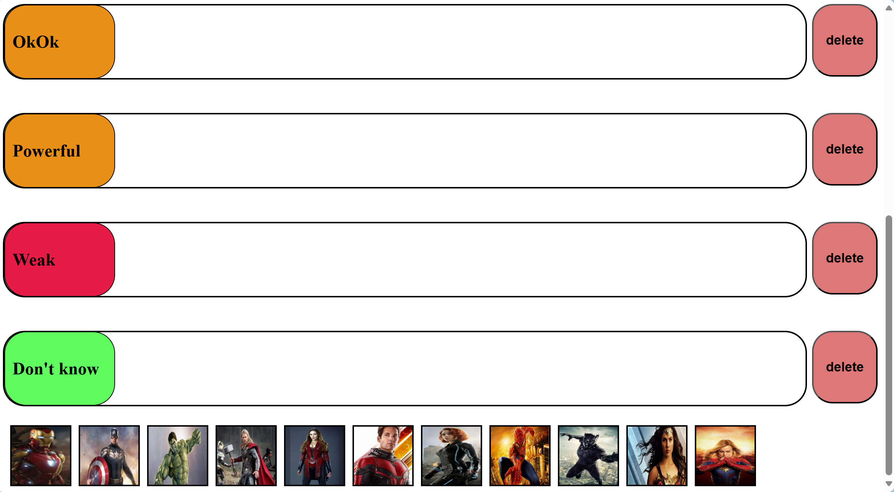
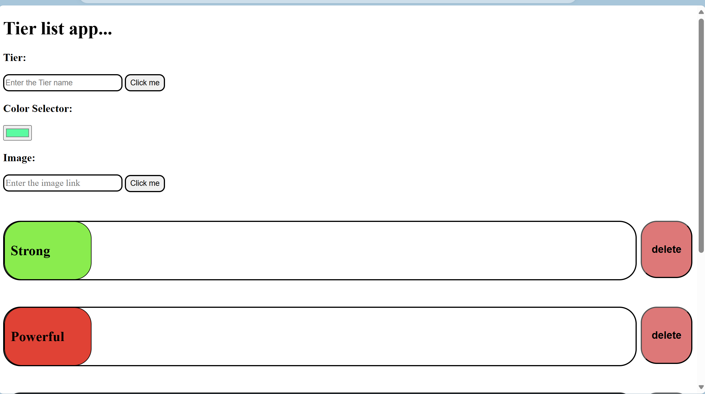
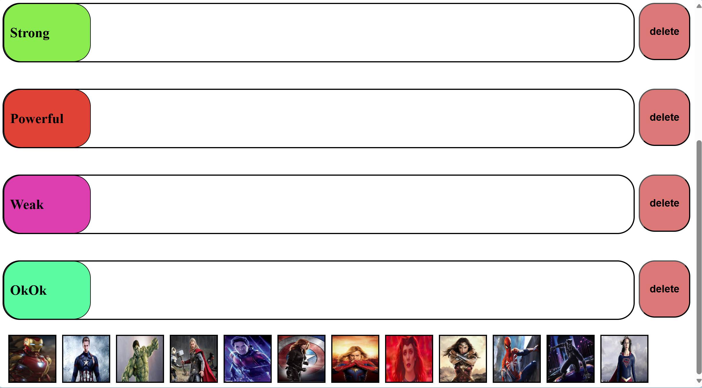
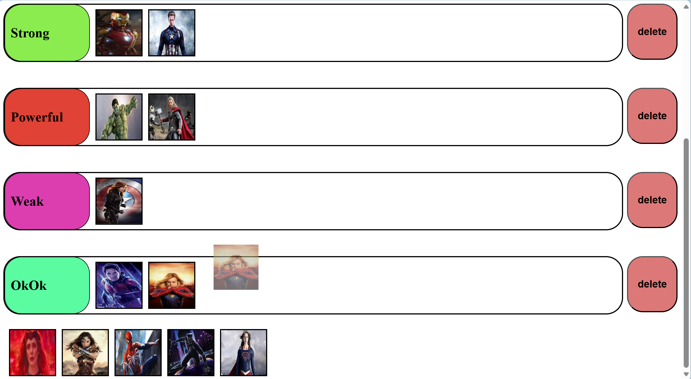
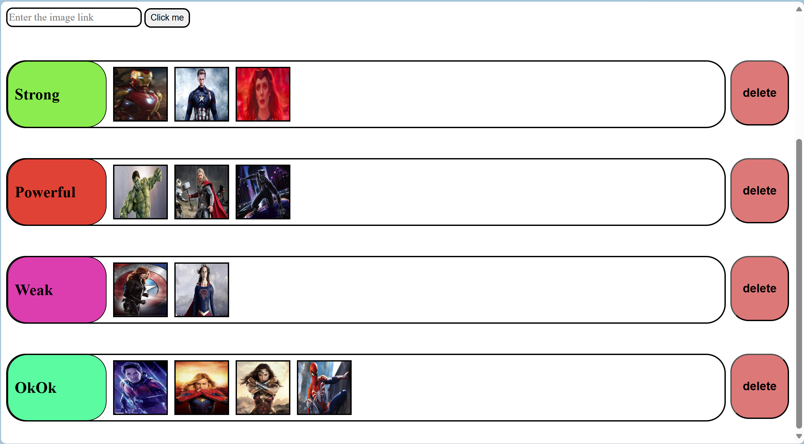

This is a basic tier app with some basic features. In this tier app you can create your own tier. Enter the name of the tier in the tier input box then choose the color of the tier and click the button. To add images paste the link of the image in the image input box and then click the button. You can also delete the tier with the help of the delete button shown in front of the tier. You can drag and drop the images from above to the tier. To remove the image from the tier double click the image. 

